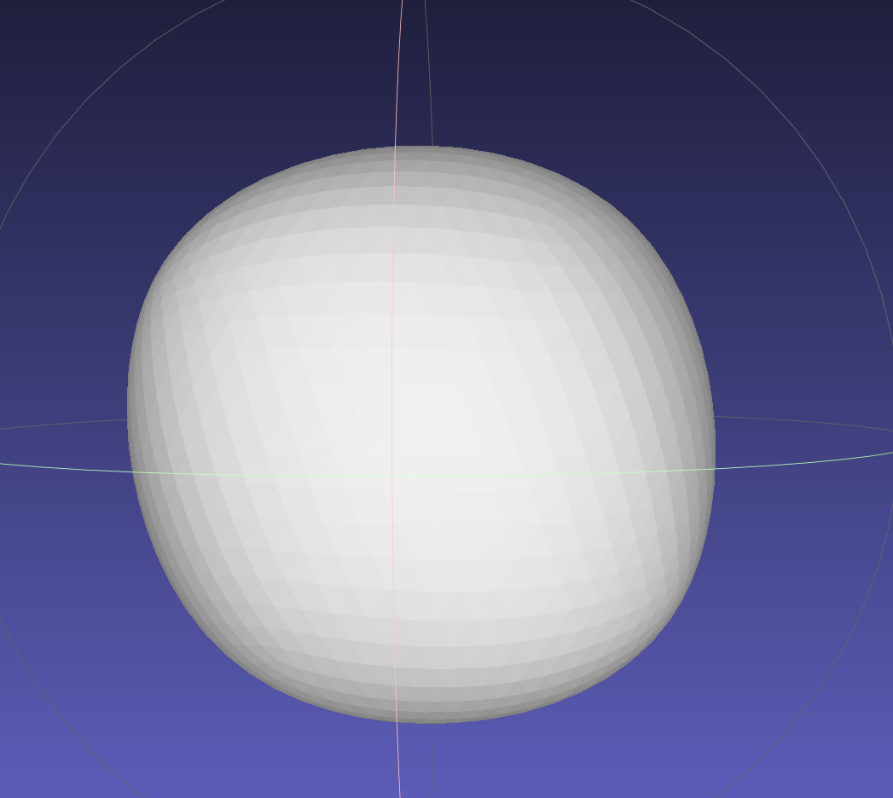
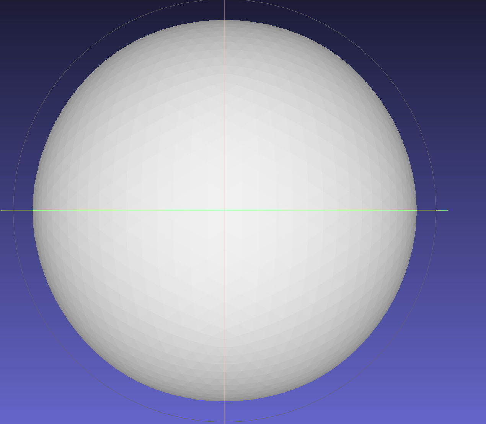
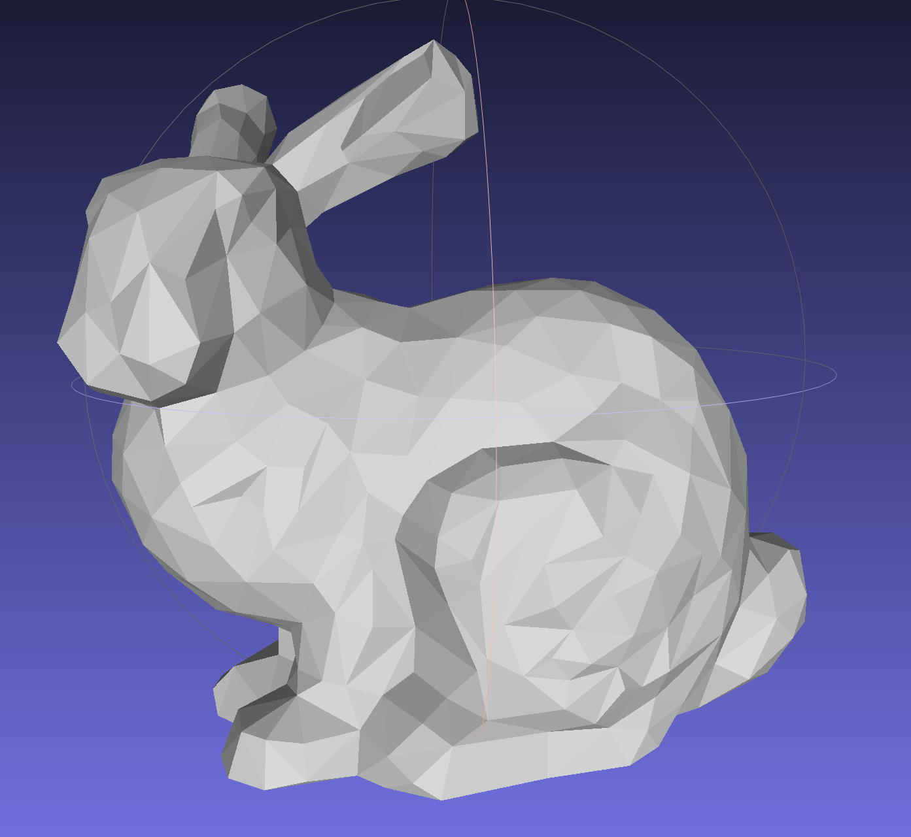

# Assignment 1 report
Emily Jia 7297802005
## Data sturcture
The graph data structure is in `assignments/graph_mesh.py`. Each vertice object save a set that contains all its adjacent vertices. For each edge, all the faces contain this edge is saved in the edge object. The `Graph` object save a dict whose keys are the two vertice of every edge. 

## Loop subdivision
The core code for loop subdivision is in the func `_subdivision_step` in `assignments/assignment1.py`. For even verts, I found that using 
```python
beta = 1/n * (5/8 - (3/8 + 1/4 * np.cos(2 * np.pi / n))**2)
```
gives better results than using `beta = 3 / (8 * n) if n > 3 else 3 / 16`. 

I have tested my loop subdivision implementation on box and icosahedron from 1 iteration to 5 iterations. The results are saved in `assets/assignment1/`. I also have the result of trimesh implementation on box saved in `assets/assignment1/gt_1.obj` (1 iteration), from comparison. 

My loop subdivision result on box with 5 iterations:


My loop subdivision result on icosahedron with 5 iterations:



## Quadric error
The core code for quadric error simplification is in func `simplify_quadric_error` in `assignments/assignment1.py`. I used stanford bunny (manifold version) as testing objects (the original version downloaded from the official website is not manifold). The objects contains 64566 faces. I simplified it to 1024 faces. The result is saved in `assets/assignment1/bunny_decimated.obj`. I also have the result of trimesh implementation saved in `assets/assignment1/bunny_decimated_gt.obj`. 

The simplified mesh from my implementation: 
