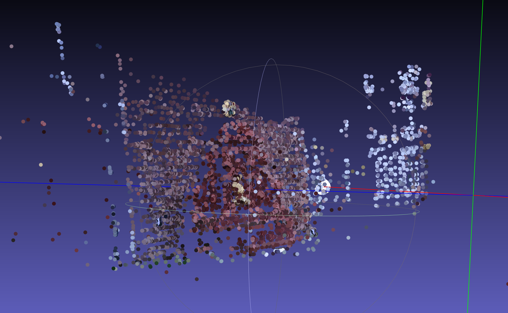
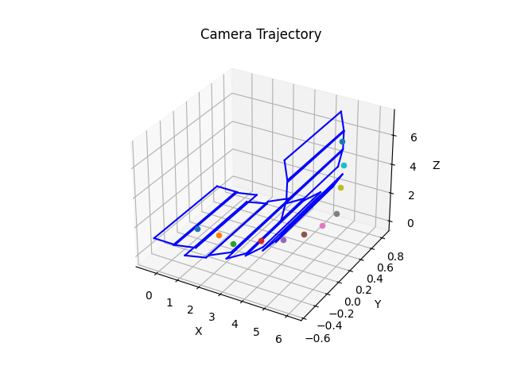
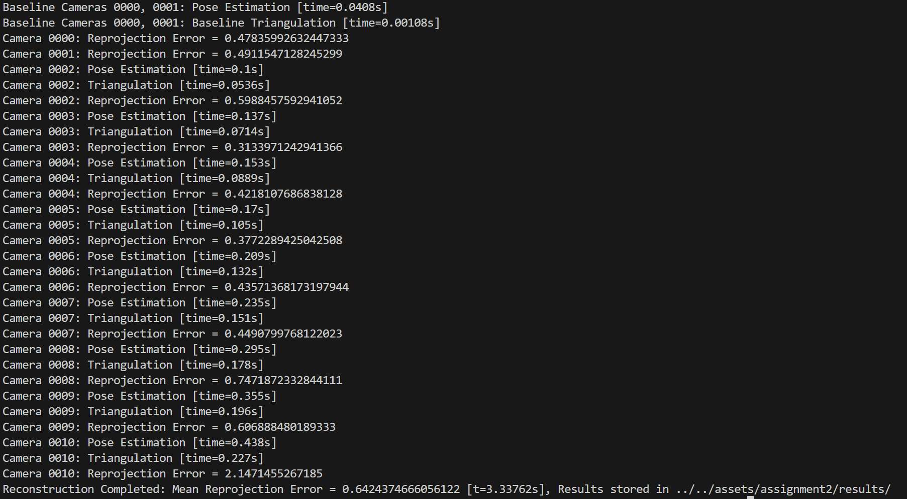

# Assignment 2 report
Emily Jia 7297802005
## Compute reprojection error
To compute reconstruction error, we need to project the 3d point from `self.point_cloud` and compare them with their corresponding 2D image points. The `ref` array saved in `self.image_data` stores the corresponding `idx` in `self.point_cloud` for every keypoint. If `ref == -1`, then that keypoint have no corresponding 3D point in `self.point_cloud`. 

After the 2D-3D pairs are got, the projections of 3D points are computed using `cv2.projectPoints` function. I chose mean L2-distance between keypoints and their projection as reprojection error metric. 

## Visualize reprojection
Keypoints and their projections are first round to integer and then plot as blue and green dots on the image, respectively. I also connect each pair using red line. However, the reprojection error is so small that the red line can not be seen. 

## Triangluate new view
For every keypoint in current view, we try to find its correspondence with un-matched keypoints in previous views. If there exists multiple matches, the one with smallest view index is chosen for triangluation. 

To get a cleaner point cloud, we reject the matches with large projection error. In detail, we first compute triangluation results for all possible matches and then reproject the 3D points to both current view and the previous view. The 3D point is accepted if its reprojection errors to both views are below 8 (as set in `--reprojection_thres`, which is also used in `PnPRansac`).
Otherwise the point will not be added to `self.point_cloud`.

## Results
The point cloud for `fonutain-P11` is shown below:

Camera trajectory:

Reprojection error image for final view is shown below:

Run time output from `sfm.py`:
